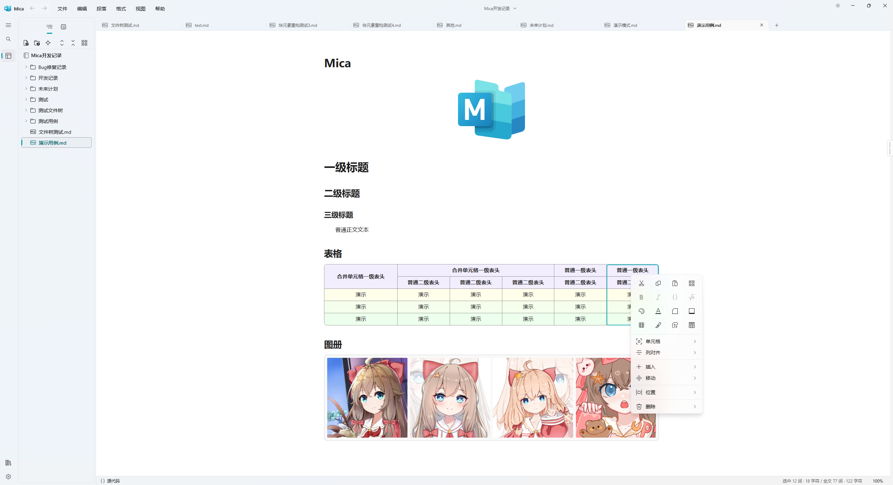
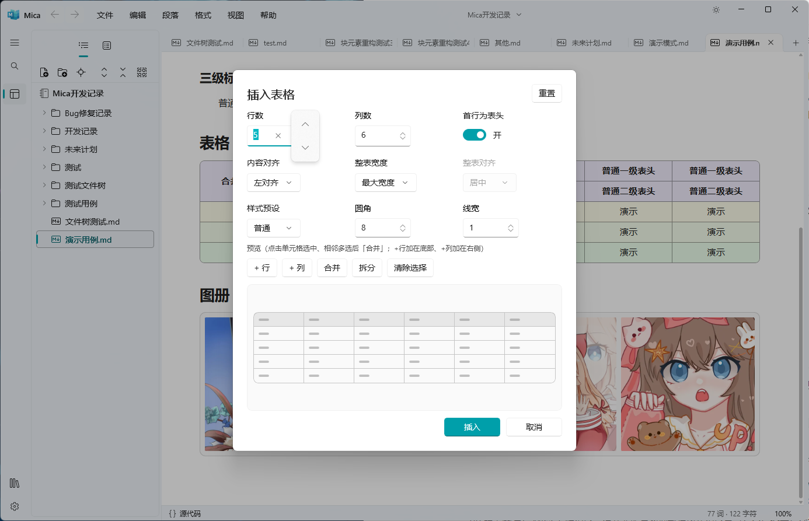
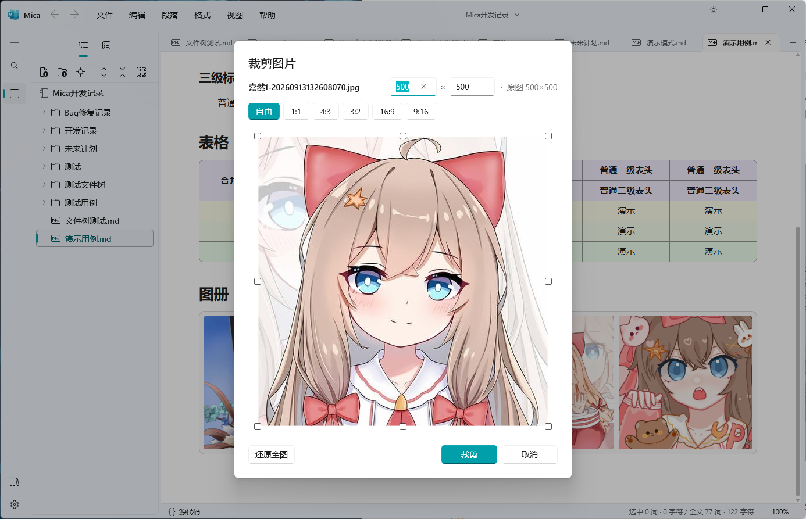
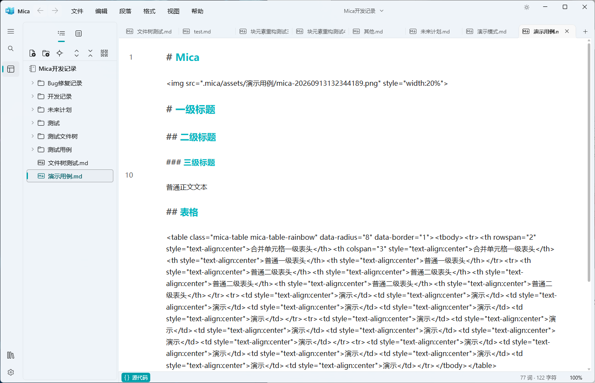
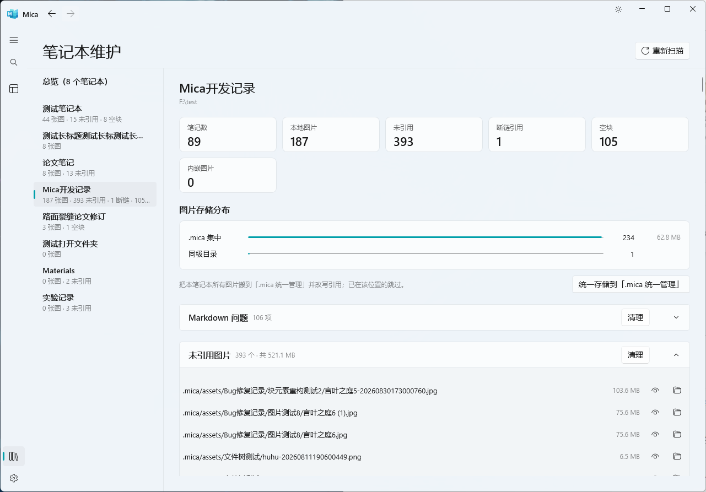

# Mica

<p align="center">
  
</p>

一款面向 Windows 的 Markdown 编辑器与轻量笔记管理应用。

Mica 将所见即所得的书写体验与文件夹管理结合起来：打开就写，用熟悉的目录组织笔记，让内容保存在自己的 Markdown 文件中。界面采用 WinUI 3 与 Fluent Design 2 风格，融入 Windows 的 Mica 材质。

[下载发布版](https://github.com/limiaowu/Mica/releases) · [反馈问题](https://github.com/limiaowu/Mica/issues)

软件主界面：



## 专注书写

- **所见即所得**：在正文中直接编辑 Markdown，支持标题、列表、任务列表、引用、链接与常用文字格式。
- **丰富内容**：代码块与语法高亮、LaTeX 公式、表格、图片、图册、折叠块和 HTML 内容。
- **源码模式**：按需查看和编辑 Markdown 源码，与正文模式共用文档和撤销历史。
- **写作工具**：大纲导航、查找替换、字数统计，以及独立的只读演示窗口与临时批注。
- **原生界面**：明暗主题、可调整侧栏、多标签页与原生菜单。







## 文件夹就是笔记本

一个笔记本对应一个文件夹。你可以把文件夹注册为笔记本，也可以直接打开普通文件夹或单个 Markdown 文件。

- 在文件树中创建、重命名、移动和整理笔记。
- 同时打开不同目录中的笔记，切换笔记本时保留已打开的标签。
- 编辑内容自动保存；新建草稿也有实际文件，之后可另存到需要的位置。
- 笔记以文件形式保存在磁盘，不依赖专有数据库。

Mica 专注编辑和轻量管理，不提供知识图谱、反向链接或插件系统。




## 下载与运行

当前 ZIP 分发包面向 **Windows x64**。建议使用 Windows 11，以获得完整的原生视觉体验；其他系统版本的兼容情况请以对应 Release 的说明为准。

1. 前往 [Releases](https://github.com/limiaowu/Mica/releases)，下载发布附件中的应用 ZIP（不是 GitHub 自动生成的 `Source code`）。
2. 将压缩包完整解压到可写目录。
3. 打开其中的 `Mica` 文件夹，运行 `Mica.exe`。请保留同目录下的依赖和资源，不要单独移动 EXE。

分发包包含 .NET 和 Windows App Runtime，但仍需要 **Microsoft Edge WebView2 Runtime**。如果电脑尚未安装，请从 [微软官网下载 Evergreen Runtime](https://developer.microsoft.com/microsoft-edge/webview2/#download-section)。相关依赖说明见 [微软 WebView2 分发文档](https://learn.microsoft.com/microsoft-edge/webview2/concepts/distribution)。

ZIP 版无需运行 Mica 安装程序，但并非所有数据都存放在程序目录：全局设置与标签会话保存在 `%LOCALAPPDATA%\Mica\settings.json`，笔记保存在你选择的文件夹中。

## 关于文件与兼容性

备份和迁移时，请连同图片资源一起复制整个笔记文件夹，包括可能存在的隐藏 `.mica` 目录、`assets` 或同名 `.assets` 目录。只复制 `.md` 文件可能导致图片丢失。

常规内容使用 Markdown；图册等扩展内容在其他 Markdown 软件中的呈现可能不同。首次使用或批量整理重要笔记前，建议保留备份。

## 从源码构建

需要 Windows、.NET 8 SDK、WinUI 3 构建环境，以及 Node.js 和 pnpm。前端依赖版本见 [web/package.json](web/package.json)。

在仓库根目录执行：

```powershell
dotnet build Mica.sln -c Debug -p:Platform=x64
dotnet run --project Mica/Mica.csproj -c Debug -p:Platform=x64
```

.NET 构建会自动构建 Web 编辑器并复制资源，无需单独运行前端构建。

生成自包含 ZIP 分发包：

```powershell
powershell -ExecutionPolicy Bypass -File build\pack.ps1
```

产物为 `dist\Mica.zip`。本项目使用自包含 `dotnet build` 输出打包，请勿改用 `dotnet publish`，以免遗漏 WinUI 资源和编辑器文件。

## 反馈

欢迎在 [GitHub Issues](https://github.com/limiaowu/Mica/issues) 报告问题或提出建议。报告问题时，请附上 Mica 版本、Windows 版本、复现步骤，以及必要的截图或已去除隐私内容的示例文档。

## 致谢

Mica 基于 [WinUI 3](https://github.com/microsoft/microsoft-ui-xaml)、[WebView2](https://developer.microsoft.com/microsoft-edge/webview2/)、[Milkdown](https://github.com/Milkdown/milkdown)、[ProseMirror](https://prosemirror.net/)、[CodeMirror](https://codemirror.net/) 与 [KaTeX](https://katex.org/) 等项目构建。
