# Mica

<p align="center">
  
</p>

**面向 Windows 的所见即所得 Markdown 编辑器与轻量笔记管理应用。**

Mica 将直接书写的体验与文件夹管理结合起来：用熟悉的目录组织笔记，让内容保存在自己的 Markdown 文件中。界面采用 WinUI 3 与 Fluent Design 2 风格，融入 Windows 的 Mica 材质；既可以使用简洁的明暗配色，也可以用插画与轻量动态布置自己的书写窗口。

[下载发布版](https://github.com/limiaowu/Mica/releases) · [反馈问题](https://github.com/limiaowu/Mica/issues)

> **开发状态**：目前已完成阶段性开发，近期暂停新增功能开发，后续更新暂无时间表。现有版本可继续使用，也欢迎通过 Issues 留下问题与建议。

## 专注书写

在正文中直接编辑 Markdown，按需要切换到源码模式，不必一直在源码和预览之间来回对照。

- **常用格式**：标题、列表、任务列表、引用、链接、粗体、斜体与删除线。
- **丰富内容**：语法高亮代码块、LaTeX 公式、表格、图片、图册、折叠块和 HTML 内容。
- **写作工具**：大纲导航、查找替换、字数统计，以及可调整的字体、字号和书写宽度。
- **多标签与自动保存**：同时打开多篇笔记，编辑内容自动保存到实际文件。
- **源码模式**：按需查看和编辑 Markdown 原文，再回到正文继续书写。
- **演示与导出**：独立的只读演示窗口支持临时批注；可通过导出面板输出笔记内容。

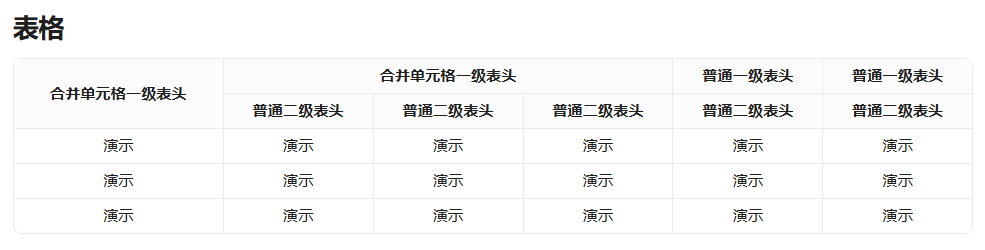

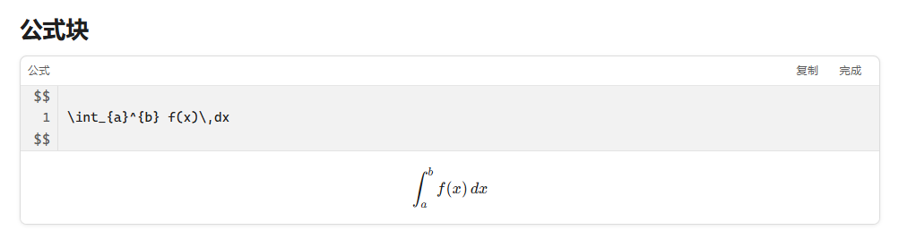


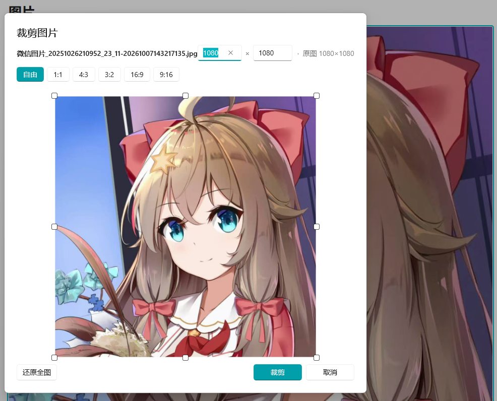


## 长文档与性能优化

Mica 对长文档的渲染、滚动、缩放与标签切换进行了多轮优化，并控制离屏内容和图片资源的常驻开销。

在作者的本机测试中，使用同一份约 **25 万字符的长文档**，观察到的常驻内存大致如下：

| 应用 | 常驻内存 |
| --- | --- |
| **Mica** | **约 400 MB** |
| Typora | 约 600 MB 以上 |
| MarkText | 约 1 GB |

以上是作者的本机观察值，实际占用会随设备、软件版本、文档内容和测量方式变化。

## 文件夹就是笔记本

一个笔记本对应一个文件夹。可以将文件夹注册为笔记本，也可以直接打开普通文件夹或单个 Markdown 文件。

- 在目录树中创建、重命名、移动和整理笔记。
- 同时打开来自不同目录的文档，切换笔记本时保留已打开的标签。
- 新建草稿也有实际文件，之后可保存到需要的位置。
- 笔记以文件形式保存在磁盘，不依赖专有数据库。

Mica 专注书写和轻量管理，不提供知识图谱、反向链接或插件系统。

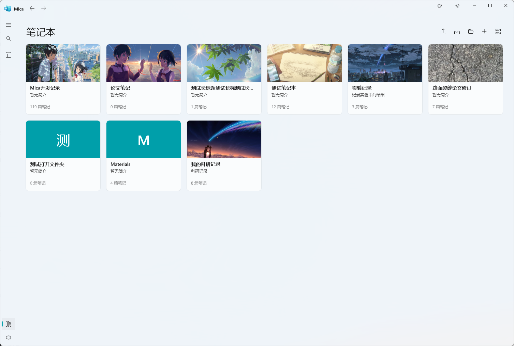

## 给书写窗口一点风景

当前公开版提供 **十一套内置主题**，风格选择与明暗偏好相互独立。

| 主题 | 风格 |
| --- | --- |
| 默认、暖纸 | 原生简洁外观与温暖纸色 |
| 春 · 新芽、夏 · 晴海、秋 · 麦穗、冬 · 初雪 | 四季配色、局部装饰与可选粒子效果 |
| 草木素笺 | 柔和的草木、水彩与纸张氛围 |
| 霓虹回路 | 午夜蓝、几何图案与科技感 |
| 樱桃奶霜 | 奶白与莓粉、樱桃花枝和阅读角 |
| 紫罗兰笺 | 花枝、蝴蝶、水晶与薰衣草紫 |
| 星海漫游 | 星云、航天器、可选天体与轻量场景动态 |

支持的主题可以分别控制局部装饰、大幅插画与动态效果。每套主题独立记住你的选择；切换主题不改变字体、字号和书写宽度。插画和装饰只用于界面，不会写入 Markdown，也不附带到导出的正文中。

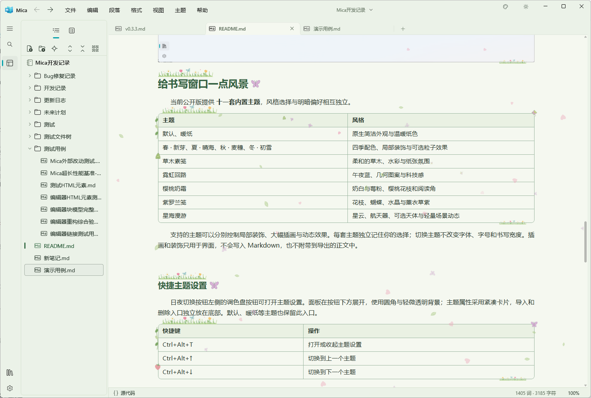

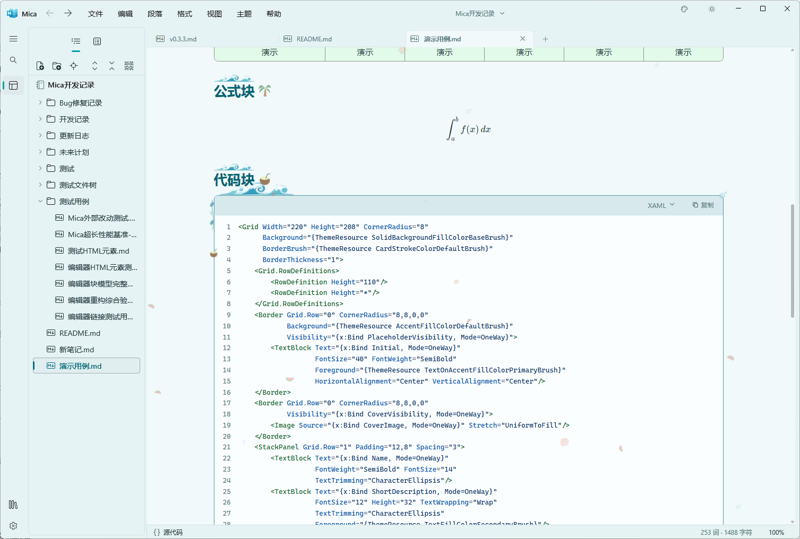

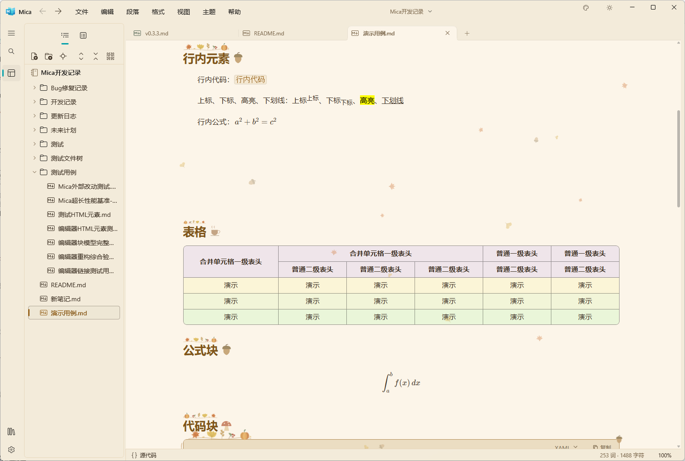

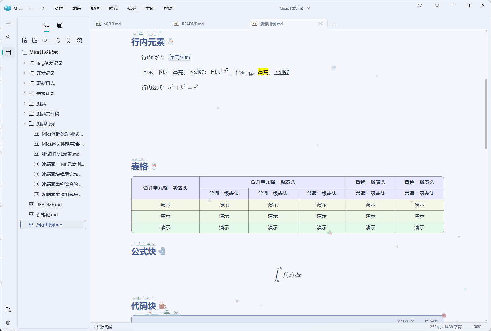

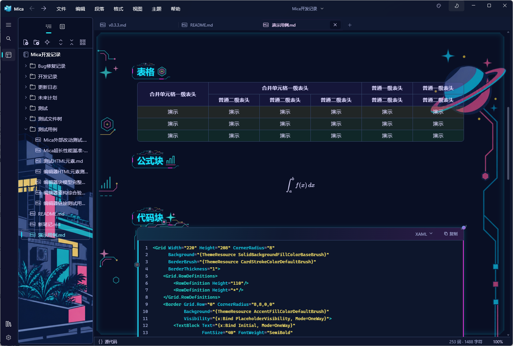

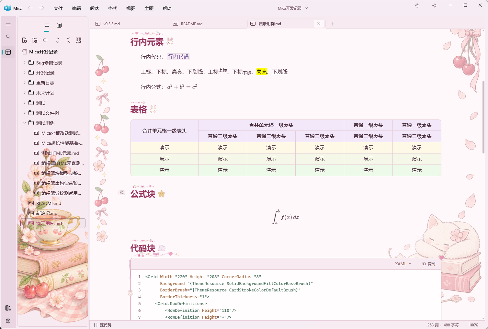

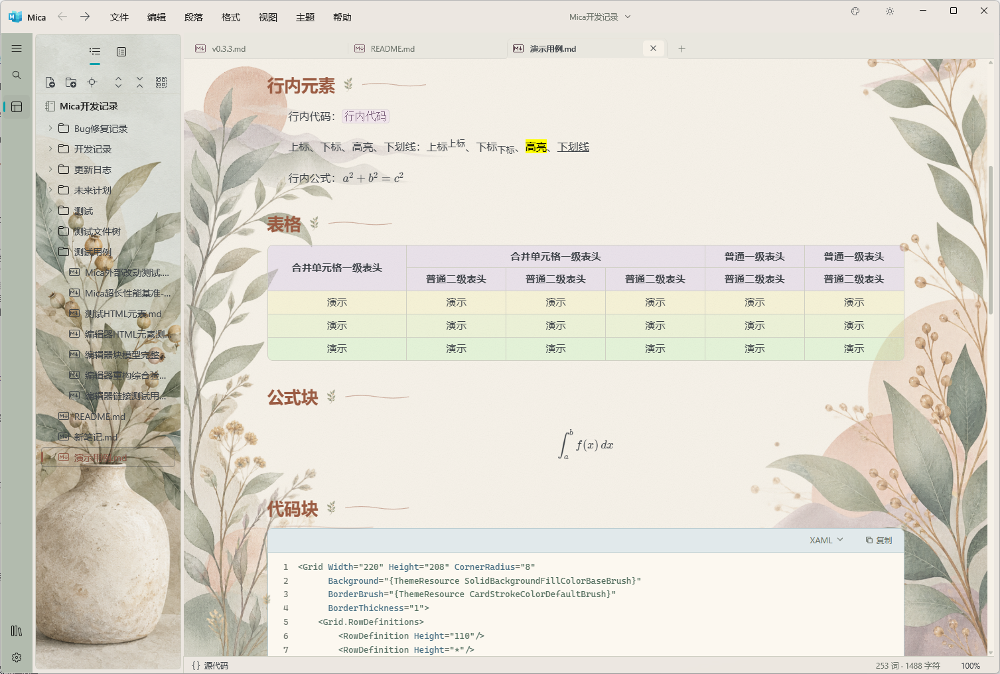

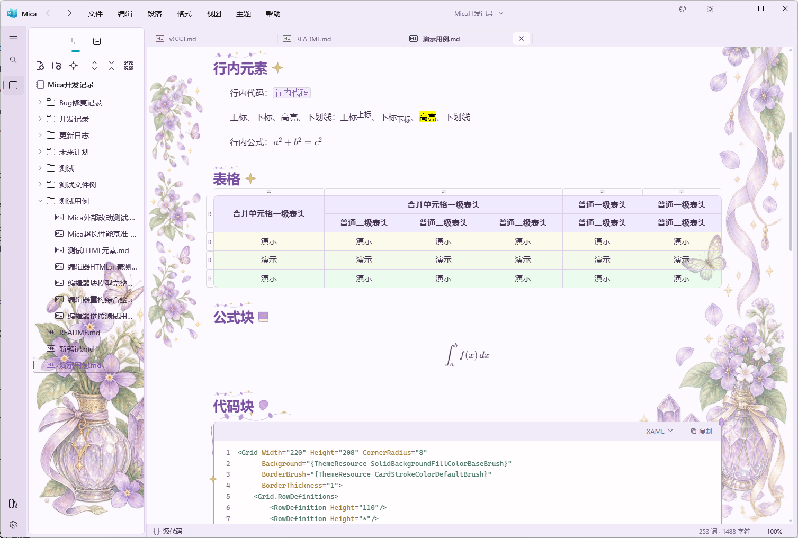

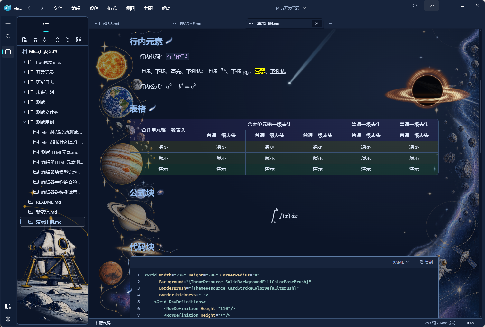

### 快捷主题设置

日夜切换按钮左侧的调色盘按钮可打开主题设置。面板在按钮下方展开，使用圆角与轻微透明背景；主题属性采用紧凑卡片，导入和删除入口独立放在底部。默认、暖纸等主题也保留此入口。

| 快捷键 | 操作 |
| --- | --- |
| Ctrl+Alt+T | 打开或收起主题设置 |
| Ctrl+Alt+↑ | 切换到上一个主题 |
| Ctrl+Alt+↓ | 切换到下一个主题 |

完整设置页仍保留各选项的说明，适合第一次配置时使用。

### 主题包与暂不公开的主题

Mica 支持导入专用的 `.mica-theme` 主题包：点击“导入主题包”，可一次选择多个文件，无需手动解压。导入后的资源保存在用户数据目录，后续普通版本更新会保留；不再使用时，可在对应主题的设置中删除。内置主题不可删除。

主题包用于管理配色、图片、音频及应用支持的效果配置，是资源包，不是插件系统，也不支持直接导入其他软件的任意主题。

此外，项目制作了两套主题用于个人体验与效果展示：

- **《星露谷物语》**：连续像素牧场、牛羊与恐龙、阿比盖尔漫步、收藏装饰，以及可选的背景音乐。
- **《你的名字》**：二人相逢、泷的晴日和三叶的晴日三组场景，明暗配对、东京与系守湖景观，以及编辑器中的动态彗星。

**由于可能涉及原作画面、角色、游戏素材及音乐的版权问题，这两套主题包暂不公开发放，GitHub 上的普通安装版与免安装版均不包含相关资源。** 后续上传的演示视频仅用于展示效果，不代表提供主题包下载。


#### 主题演示视频

点击下方链接查看演示视频；如浏览器无法直接播放，可下载后观看。

- [星露谷物语主题演示](https://github.com/limiaowu/Mica/blob/main/assets/videos/stardew-valley-demo.mp4)
- [你的名字主题演示](https://github.com/limiaowu/Mica/blob/main/assets/videos/your-name-demo.mp4)

## 下载与运行

从 [GitHub Releases](https://github.com/limiaowu/Mica/releases) 下载发布附件。分发包面向 **Windows x64**，建议使用 Windows 11；其他系统版本的兼容情况请以对应 Release 的说明为准。

### 安装版

下载 `Mica-Setup-版本-x64.exe` 并运行安装向导。可以选择安装目录、快捷方式、文件打开方式与右键菜单集成；默认按当前用户安装，不需要管理员权限。

缺少 WebView2 Runtime 时，安装程序会询问是否联网安装。文件默认打开方式仍由你在 Windows 设置中选择；Windows 11 的传统右键菜单项位于“显示更多选项”。

### 免安装版

1. 下载 `Mica-版本-x64.zip`，不要下载 GitHub 自动生成的 `Source code` 代替应用发布包。
2. 将压缩包完整解压到可写目录。
3. 打开其中的 `Mica` 文件夹，运行 `Mica.exe`。请保留同目录的依赖与资源，不要单独移动 EXE。

分发包包含 .NET 和 Windows App Runtime，仍需要 **Microsoft Edge WebView2 Runtime**。如果电脑尚未安装，可从 [微软官网下载 Evergreen Runtime](https://developer.microsoft.com/microsoft-edge/webview2/#download-section)。

### 更新与数据保存

设置页可管理自动检查、自动下载与系统集成。安装更新前需要确认退出，不会在编辑过程中强制重启；网络不可用时，也可以手动下载新版安装包或 ZIP。

- **笔记**保存在你选择的文件夹中。
- **设置、会话与应用数据**保存在 `%LOCALAPPDATA%\Mica`。
- **导入的主题资源**保存在 `%LOCALAPPDATA%\Mica\ThemePacks`，正常更新保留这些资源。

ZIP 版不需要安装 Mica，但并非所有数据都存放在程序目录。卸载保留笔记、草稿与用户设置。

## 文件与兼容性

常规内容使用 Markdown；图册等扩展内容在其他 Markdown 软件中的呈现可能不同。

备份或迁移时，请连同图片资源复制整个笔记文件夹，包括可能存在的隐藏 `.mica` 目录、`assets` 或同名 `.assets` 目录。只复制 `.md` 文件可能导致图片丢失。整理重要笔记前，建议保留备份。

## 从源码构建

技术栈为 **WinUI 3 + WebView2 + Milkdown**：Windows 原生界面承载导航、设置和文件管理，Web 编辑器负责正文编辑。

需要 Windows、.NET 8 SDK、WinUI 3 构建环境，以及 Node.js 和 pnpm。前端依赖见 [web/package.json](web/package.json)。

在仓库根目录执行：

```powershell
dotnet build Mica.sln -c Debug -p:Platform=x64
dotnet run --project Mica/Mica.csproj -c Debug -p:Platform=x64
```

.NET 构建会自动构建 Web 编辑器并复制资源，无需单独运行前端构建。

生成普通免安装包：

```powershell
powershell -ExecutionPolicy Bypass -File build\pack.ps1
```

同时生成安装包，需要 Inno Setup：

```powershell
powershell -ExecutionPolicy Bypass -File build\pack.ps1 -Installer
```

打包使用自包含 `dotnet build` 输出，请勿改用 `dotnet publish`，以免遗漏 WinUI 资源与编辑器文件。公开发布时，上传普通安装包、版本化 ZIP、`update.json` 和 `SHA256SUMS.txt`；不要上传打包流程另行生成的私人主题包。

版本统一在 [Directory.Build.props](Directory.Build.props) 中维护。同版本重新打包需手动下载安装，应用内更新只提示更高版本。

## 反馈

欢迎通过 [GitHub Issues](https://github.com/limiaowu/Mica/issues) 报告问题或留下建议。请尽量附上 Mica 版本、Windows 版本、复现步骤，以及必要的截图或已去除隐私内容的示例文档。

目前项目处于阶段性暂停开发状态，反馈处理与后续更新没有固定时间表。

## 致谢

Mica 基于 [WinUI 3](https://github.com/microsoft/microsoft-ui-xaml)、[WebView2](https://developer.microsoft.com/microsoft-edge/webview2/)、[Milkdown](https://milkdown.dev/)、[ProseMirror](https://prosemirror.net/)、[CodeMirror](https://codemirror.net/) 与 [KaTeX](https://katex.org/) 等项目构建。

感谢这些项目的维护者，也感谢每一位试用、反馈和提供建议的朋友。
